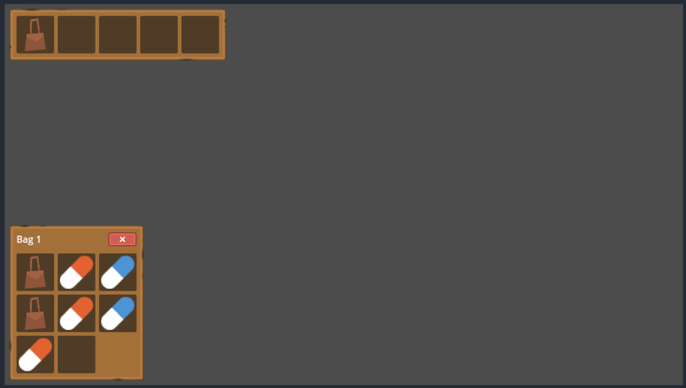

# GD Inventory System

A minimal, opinionated inventory system for Godot 4.4+ with drag-and-drop functionality, bag containers, and item management.



## Features

- **5-slot bag bar** with expandable container storage
- **Drag-and-drop interface** with visual feedback
- **Resource-based items** (.tres files) supporting ITEM, BAG, KEY, QUEST types
- **Container system** - bags provide additional inventory slots
- **Dynamic UI generation** - containers show/hide based on equipped bags
- **Item stacking** with configurable stack sizes
- **Movement validation** - prevents invalid item placements

## Quick Start

1. Copy `addons/gd-inventory-system/` to your project's `addons/` folder
2. Enable "GD Inventory System" in Project Settings → Plugins
3. Add `Inventory.tscn` to your scene
4. Configure `starter_items` array in the inspector

## Core Classes

- **Item** (`Items/item.gd`): Resource with ItemType enum and properties (name, icon, type, container_size, stackable)
- **Inventory** (`Inventory/Inventory.gd`): Main inventory controller with bag/item management
- **InventorySlot** (`Inventory/InventorySlot.gd`): Drag-and-drop slot component with swap functionality
- **BagSlot** (`Inventory/BagSlot.gd`): Specialized slot for bag bar with container toggle

## Architecture

The system uses a hybrid design:
- **Bag Bar**: 5 fixed slots for equipping bags
- **Container Grids**: Dynamic inventory spaces based on equipped bags' `container_size`
- **Item Management**: Arrays `equipped_bags[5]` and `inventory_items[5][container_size]`

### UI Generation
- Procedural button creation in `_ready()`
- Container visibility toggled by bag bar clicks
- Automatic slot updates when bags are moved

### Movement Rules
- Only bags allowed in bag bar slots
- Bags cannot move if they contain items
- Bags cannot move into themselves
- Items move freely between compatible slots

## File Structure

```
addons/gd-inventory-system/
├── Items/                    # Item resources and definitions
├── Inventory/               # Core inventory scenes and scripts
├── Assets/                  # Art assets (Kenney packs)
├── plugin.cfg              # Plugin configuration
└── inventory_system.gd     # Main plugin script
```